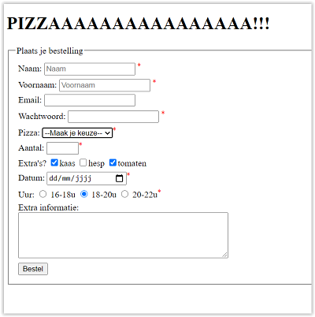
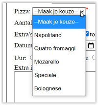
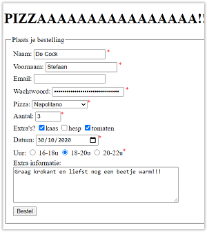
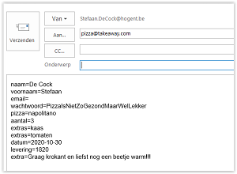

# Oefeningen les 5: Formulieren

## OEFENING 1: BolDotCom.
De bedoeling van deze oefening is om het registratieformulier van de BolDotCom webwinkel na te bouwen. Het uiteindelijke resultaat moet er als volgt uitzien:    

**Algemene beschrijving**
Het formulier waarin de accountgegevens worden ingevuld bestaat uit 3 fieldsets: 
- 1 voor de persoonlijke gegevens, 
- 1 voor de inloggegevens, 
- 1 waarin de gebruiker kan aangeven welke nieuwsbrieven hij/zij wilt ontvangen. 

We bouwen ze stuk voor stuk op.      
Merk op: alle verplichte velden staan aangeduid met een rode asterix. Gebruik hiervoor    

    *     

Elke lijn (zie screenshot hierboven) zit in een `
` tag.       

**Persoonlijke gegevens**     
1. Voeg om te beginnen een form element toe in de main. Alle fieldsets komen hierin te staan.
2. Voeg binnen het formulier een eerste fieldset toe. Deze heeft als legend “Persoonlijke gegevens”.
3. Voeg de verschillende form controls toe. Elk komt binnen een eigen div-element te staan, behalve voornaam/achternaam en straatnaam/huisnummer en bus: die staan per twee in een div-element. Elk element moet ook een label krijgen: als op het label van een veld geklikt wordt springt de cursor naar het bijhorende invoerveld.
    - De aanhef bestaat uit 2 radio buttons. Deze hebben als name “aanhef”. De gebruiker is verplicht een keuze te maken. Standaard is “Mevrouw” geselecteerd.
    - De voornaam en achternaam zijn gewone inputvelden. Hun name is respectievelijk “voornaam” en “achternaam”. Beide zijn verplicht.
    - De bedrijfsnaam is ook een gewoon tekstveld, met name “bedrijfsnaam”. Niet verplicht.
    - Postcode en gemeente is een gewoon tekstveld, met name “postcode_gemeente”. Verplicht in te vullen.
    - Straatnaam en huisnummer en bus zijn twee aparte tekstvelden. Beide zijn verplicht. Kies zelf een gepaste name voor beide.
    - Land is een select list. De gebruiker kan kiezen tussen “België” en “Nederland”. Kies zelf logische waarden voor het name en value attribuut. Standaard is “België” geselecteerd. Men is verplicht een land te kiezen.
    - De extra adresregel is weer een gewoon tekstveld en moet niet ingevuld worden. Kies een logische name.
    - De geboortedatum is een date-veld. Moet niet ingevuld worden.
    - Het telefoonnummer moet verplicht ingevuld worden. Gebruik type “tel”, voeg eventueel pattern toe (zie https://developer.mozilla.org/en-US/docs/Web/HTML/Element/input/tel).

    

**Inloggegevens**
1. Voeg een nieuwe fieldset toe voor de Inloggegevens. Zorg voor de juiste titel in de legend.
2. Voeg de form controls toe
    - Het emailadres is verplicht in te vullen. Gebruik het correcte type zodat enkel geldige emailadressen aanvaard zullen worden. Zet een placeholder met daarin een voorbeeldemailadres.
    - Wachtwoord moet ook verplicht ingevuld worden. Gebruik hier ook het gepaste type zodat sterretjes getoond worden in plaats van het wachtwoord. 

    

**Nieuwsbrief**
1. Voeg de laatste fieldset toe voor de nieuwsbrieven. Zorg voor de juiste titel in de legend.
2. De selectie voor de nieuwsbrieven staat binnen een tabel. Deze bestaat uit 3 rijen en 2 kolommen. De bovenste rij bevat de hoofdingen, de twee volgende rijen bestaan uit een cel met een checkbox en een cel met de uitleg van de bijhorende nieuwsbrief. Beide checkboxen zijn standaard aangevinkt.
3. Voeg tenslotte nog een *verzenden* knop toe.

    

-------

## OEFENING 2: Pizzaaaaaaaa

**Maak een formulier om een pizza te bestellen.**      

Bekijk de screenshots nauwkeurig om dit formulier te maken.     
Merk op: alle verplichte velden staan aangeduid met een rode asterix. Gebruik hiervoor    

    *     

Elke lijn (zie screenshot hierboven) zit in een `
` tag.  

**Formulier**     

      

**Keuzelijst**      

**Ingevuld formulier en email na verzenden**      

